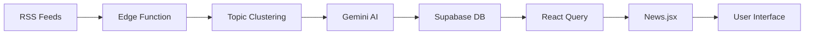
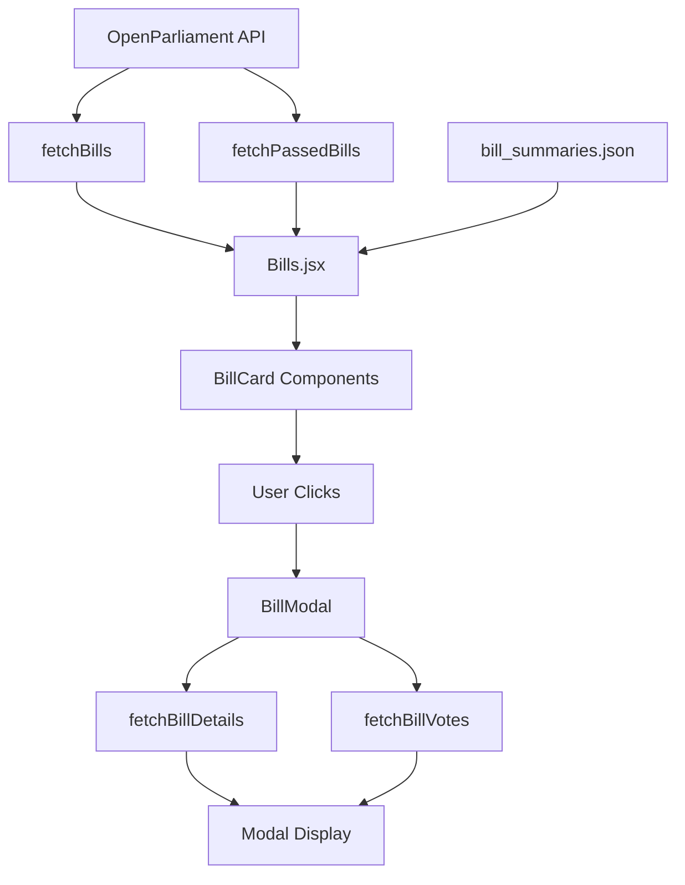
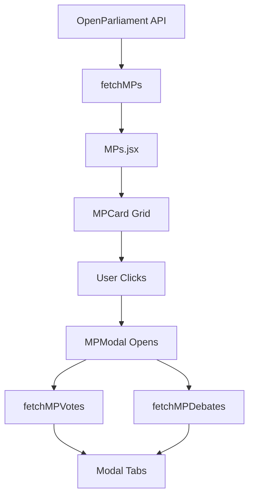
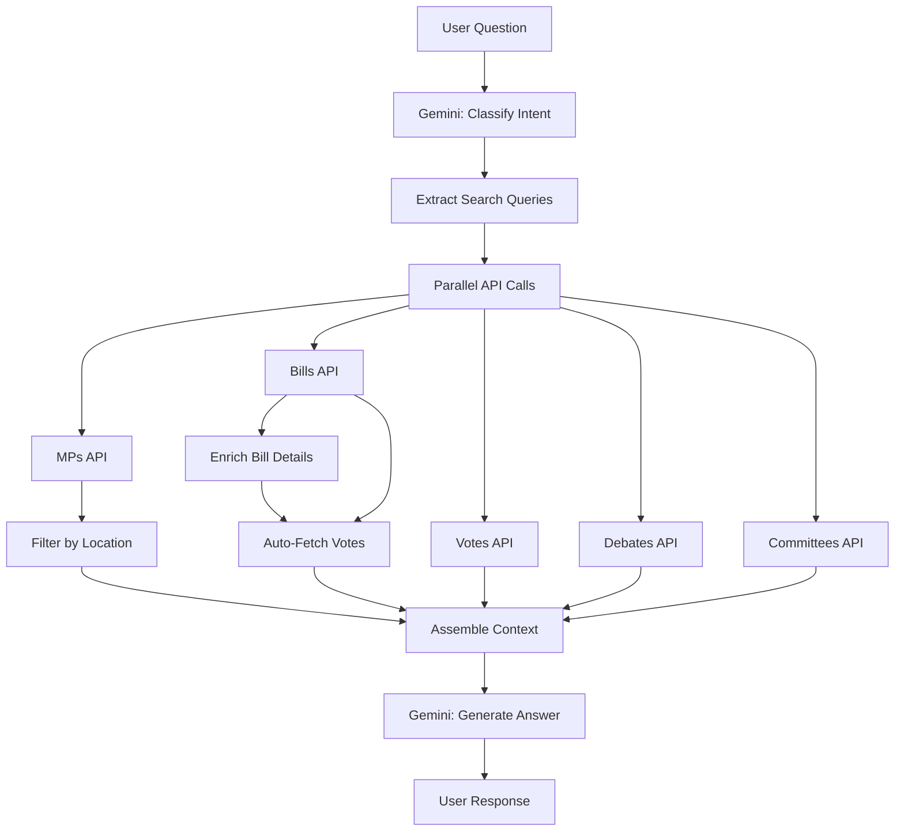

# Parliament Watch - Complete Technical Documentation

## Table of Contents
1. [Project Overview](#project-overview)
2. [Technology Stack](#technology-stack)
3. [Project Architecture](#project-architecture)
4. [Database Schema](#database-schema)
5. [Feature Documentation](#feature-documentation)
   - [News Feed](#1-news-feed-feature)
   - [Bills Tracker](#2-bills-tracker-feature)
   - [MPs Directory](#3-mps-directory-feature)
   - [AI Chatbot](#4-ai-chatbot-feature)
6. [API Integration](#api-integration)
7. [Component Architecture](#component-architecture)
8. [Service Layer](#service-layer)
9. [State Management](#state-management)
10. [Deployment Considerations](#deployment-considerations)

---

## Project Overview

**Parliament Watch** is a comprehensive Canadian Parliament transparency platform that provides citizens with:
- AI-analyzed news from multiple political perspectives
- Real-time federal legislation tracking
- MP information and voting records
- An intelligent chatbot for parliamentary inquiries

The application aims to make Canadian politics more accessible and transparent by aggregating information from official sources and presenting it in an easy-to-understand format.

---

## Technology Stack

### Frontend
- **Framework**: React 18.2.0
- **Build Tool**: Vite 5.0
- **Router**: React Router DOM 6.20.0
- **Styling**: TailwindCSS 3.3.0 with custom design system
- **UI Components**: Custom components + Radix UI primitives
- **State Management**: TanStack React Query 5.0
- **Date Handling**: date-fns 3.0
- **Icons**: Lucide React 0.300.0
- **Notifications**: Sonner 1.0

### Backend Services
- **Database**: Supabase (PostgreSQL)
- **Edge Functions**: Supabase Edge Functions (Deno runtime)
- **AI/ML**: Google Gemini 2.0 Flash API
- **External API**: OpenParliament.ca API

### Development Tools
- **Linter**: ESLint 8.50.0
- **CSS Processing**: PostCSS 8.0 + Autoprefixer 10.0
- **TypeScript**: TypeScript type definitions for React

---

## Project Architecture

### Directory Structure
```
Hackathon/
├── src/
│   ├── components/        # Reusable UI components
│   │   ├── bills/         # Bill-specific components
│   │   ├── mps/           # MP-specific components
│   │   ├── news/          # News-specific components
│   │   └── ui/            # Shared UI primitives
│   ├── pages/             # Main page components
│   │   ├── News.jsx       # News feed page
│   │   ├── Article.jsx    # Article detail page
│   │   ├── Bills.jsx      # Bills tracker page
│   │   ├── MPs.jsx        # MPs directory page
│   │   └── Chatbot.jsx    # AI chatbot page
│   ├── services/          # Business logic layer
│   │   ├── newsService.js
│   │   ├── billService.js
│   │   ├── mpService.js
│   │   └── chatbotService.js
│   ├── lib/               # Library code
│   │   ├── api.js         # OpenParliament API client
│   │   └── supabase.js    # Supabase client
│   ├── data/              # Static data
│   │   └── bill_summaries.json
│   ├── App.jsx            # Main app component
│   ├── Layout.jsx         # Layout wrapper
│   └── main.jsx           # Entry point
├── supabase/
│   └── functions/         # Edge functions
│       ├── fetch-rss-news/
│       └── parliament-chatbot/
├── public/                # Static assets
└── package.json
```

### Application Flow

1. **Entry Point** (`main.jsx`): Initializes React app with providers
2. **App Component** (`App.jsx`): Sets up routing and query client
3. **Layout** (`Layout.jsx`): Provides navigation and consistent styling
4. **Pages**: Individual routes render page components
5. **Services**: Handle data fetching and business logic
6. **Components**: Reusable UI pieces

---

## Database Schema

### Tables

#### `news_topics`
Stores aggregated news topics analyzed from multiple sources.

| Column | Type | Description |
|--------|------|-------------|
| `id` | UUID | Primary key |
| `created_at` | TIMESTAMP | Creation timestamp |
| `topic` | TEXT | Unique topic identifier/name |
| `headline` | TEXT | Main headline for the topic |
| `ai_summary` | TEXT | AI-generated summary |
| `thumbnail_url` | TEXT | Featured image URL |
| `published_date` | TIMESTAMP | Publication date |
| `source_count_left` | INTEGER | Number of left-leaning sources |
| `source_count_centre` | INTEGER | Number of centrist sources |
| `source_count_right` | INTEGER | Number of right-leaning sources |
| `left_emphasis` | TEXT[] | Points emphasized by left sources |
| `right_emphasis` | TEXT[] | Points emphasized by right sources |
| `common_ground` | TEXT[] | Points agreed upon by all sources |
| `key_points` | TEXT[] | Key takeaways |
| `tags` | TEXT[] | Topic tags |
| `is_featured` | BOOLEAN | Featured story flag |

#### `news_articles`
Stores individual news articles from RSS feeds.

| Column | Type | Description |
|--------|------|-------------|
| `id` | UUID | Primary key |
| `created_at` | TIMESTAMP | Creation timestamp |
| `topic` | TEXT | Related topic identifier |
| `title` | TEXT | Article title |
| `url` | TEXT | Article URL |
| `source` | TEXT | News source name |
| `source_bias` | TEXT | Political bias (Left/Centre/Right) |
| `published_date` | TIMESTAMP | Publication date |
| `thumbnail_url` | TEXT | Article image |
| `summary` | TEXT | Article summary |

#### `news_sources`
Configures RSS feed sources.

| Column | Type | Description |
|--------|------|-------------|
| `id` | BIGINT | Primary key (auto-increment) |
| `name` | TEXT | Source name |
| `rss_feed_url` | TEXT | RSS feed URL |
| `bias_rating` | TEXT | Political bias rating |
| `is_active` | BOOLEAN | Active status |
| `created_at` | TIMESTAMP | Creation timestamp |

**Seeded Sources:**
- CBC News (Left)
- CTV News (Centre)
- Global News (Centre)
- National Post (Right)
- Toronto Star (Left)

#### `bills`
Stores analyzed federal bills (currently using OpenParliament API directly).

| Column | Type | Description |
|--------|------|-------------|
| `id` | UUID | Primary key |
| `created_at` | TIMESTAMP | Creation timestamp |
| `bill_number` | TEXT | Bill number (e.g., C-11) |
| `title` | TEXT | Bill title |
| `summary` | TEXT | Plain-language summary |
| `why_it_matters` | TEXT | Explanation of importance |
| `status` | TEXT | Current status |
| `introduced_date` | TIMESTAMP | Introduction date |
| `historical_context` | TEXT | Background information |
| `party_positions` | JSONB | Party stances |
| `openparliament_url` | TEXT | OpenParliament link |
| `vote_summary` | JSONB | Voting summary |

#### `mps`
Stores MP information (currently using OpenParliament API directly).

| Column | Type | Description |
|--------|------|-------------|
| `id` | UUID | Primary key |
| `name` | TEXT | MP name |
| `riding` | TEXT | Electoral district |
| `party` | TEXT | Political party |
| `province` | TEXT | Province |
| `photo_url` | TEXT | Profile photo URL |
| `email` | TEXT | Contact email |
| `phone` | TEXT | Contact phone |
| `openparliament_id` | TEXT | OpenParliament ID |
| `openparliament_url` | TEXT | OpenParliament profile |

---

## Feature Documentation

## 1. News Feed Feature

### Overview
The News Feed aggregates Canadian political news from multiple RSS sources, analyzes them using AI to identify topics, and presents a bias-aware view showing how different political perspectives cover the same story.

### User Experience

**Main Page (`/news`)**
- **Top Story**: Large featured article with thumbnail, headline, summary, and bias distribution
- **Side Headlines**: 4 smaller articles with thumbnails and bias indicators
- **Grid Layout**: Additional 9 articles in a 3-column grid
- **Bias Visualization**: Color-coded bars showing left/centre/right source distribution

**Article Page (`/article?id=...`)**
- **Hero Image**: Full-width article thumbnail
- **Headline & Summary**: AI-generated unbiased summary
- **Key Points**: Bulleted list of main takeaways
- **Bias Breakdown**: Side-by-side comparison of left vs right emphasis
- **Common Ground**: Points agreed upon across political spectrum
- **Source Links**: List of all original articles with bias labels

### Technical Implementation

#### Component: `News.jsx`

**Data Fetching:**
```javascript
const { data: topics = [], isLoading } = useQuery({
    queryKey: ['news-topics'],
    queryFn: newsService.getTopics,
    initialData: [],
});
```

**Features:**
1. **Topic Filtering**: Filters out invalid topics without headlines
2. **Featured Topic Detection**: Identifies the featured story or defaults to first
3. **Source Distribution Calculation**: Computes left/centre/right percentages
4. **Navigation**: Click-to-navigate to detailed article view
5. **Date Formatting**: Uses `date-fns` for consistent date display

**Topic Card Structure:**
- Thumbnail image with fallback
- Category tag (Politics, etc.)
- Headline (truncated with `line-clamp-3`)
- Summary (AI-generated)
- Bias distribution bar
- Source count and view count

#### Component: `Article.jsx`

**Data Fetching:**
```javascript
const { data: topic } = useQuery({
    queryKey: ['topic', topicId],
    queryFn: async () => {
        const { data, error } = await supabase
            .from('news_topics')
            .select('*')
            .eq('id', topicId)
            .single();
        return data;
    },
    enabled: !!topicId,
});

const { data: sources = [] } = useQuery({
    queryKey: ['topic-sources', topic?.topic],
    queryFn: async () => {
        const { data } = await supabase
            .from('news_articles')
            .select('*')
            .eq('topic', topic.topic);
        return data;
    },
    enabled: !!topic,
});
```

**UI Components:**
1. **Hero Section**: Large image, date, headline
2. **Coverage Statistics**: Source count with bias breakdown
3. **Bias Distribution Bar**: Visual representation of source distribution
4. **AI Summary**: Large, readable text
5. **Key Points Card**: Bordered card with bulleted points
6. **Bias Breakdown Card**: 
   - Left emphasis (blue background)
   - Right emphasis (red background)
   - Common ground (gray background)
7. **Source Articles**: Clickable list with external link icons

#### Service: `newsService.js`

**Purpose**: Handles news data fetching from Supabase

**Methods:**

1. **`getTopics()`**
   - Fetches topics that have CBC articles (quality filter)
   - Extracts unique topic names
   - Retrieves full topic data ordered by recency
   - Limits to 20 most recent topics

2. **`fetchAndAnalyzeNews()`**
   - Invokes Supabase Edge Function `fetch-rss-news`
   - Triggers RSS feed fetching and AI analysis
   - Returns success/error status

### Backend: Edge Function

**Edge Function: `fetch-rss-news`**

Located in: `supabase/functions/fetch-rss-news/index.ts`

**Workflow:**
1. **Fetch RSS Feeds**: Retrieves articles from configured sources
2. **Topic Clustering**: Groups similar articles using text similarity
3. **AI Analysis (Gemini)**:
   - Generates neutral headline
   - Creates unbiased summary
   - Identifies key points
   - Extracts left vs right emphasis
   - Finds common ground
   - Assigns tags
4. **Bias Distribution**: Counts sources by political lean
5. **Thumbnail Selection**: Chooses representative image
6. **Database Insert**: Stores topics and articles

**AI Prompt Structure:**
- Analyzes multiple article titles and summaries
- Compares perspectives across political spectrum
- Generates factual, unbiased content
- Structures output as JSON

### Data Flow



### Design Patterns

**Card-Based Layout:**
- Featured story uses full-width card
- Side stories use compact horizontal cards
- Grid stories use vertical cards with fixed image heights

**Responsive Design:**
- Mobile: Single column stack
- Tablet: 2-column grid
- Desktop: 3-column grid with featured left sidebar

**Color Coding:**
- Left sources: Blue (`rgb(59, 130, 246)`)
- Centre sources: Gray (`rgb(156, 163, 175)`)
- Right sources: Red (`rgb(239, 68, 68)`)

---

## 2. Bills Tracker Feature

### Overview
Federal legislation tracker that displays Canadian bills in plain language, with status tracking, filtering, and detailed information including voting records.

### User Experience

**Main Page (`/bills`)**
- **Search Bar**: Filter by bill number, title, or content
- **Status Filters**: All Bills, Passed, Pending
- **Bill Cards**: Display number, title, summary, status badge, date
- **Sort Order**: Newest bills first by introduction date
- **Refresh Button**: Manually update bill data

**Bill Modal**
- **Bill Details**: Full title, number, status, dates
- **Summary**: Plain-language explanation
- **Status Timeline**: Visual representation of legislative progress
- **Voting Records**: Party-by-party breakdown
- **External Links**: OpenParliament and official sources

### Technical Implementation

#### Component: `Bills.jsx`

**Data Fetching:**
```javascript
const { data: billsData = {} } = useQuery({
    queryKey: ['bills'],
    queryFn: fetchBills,
});

const { data: passedBillsData = {} } = useQuery({
    queryKey: ['passedBills'],
    queryFn: fetchPassedBills,
});
```

**Features:**

1. **Dual API Calls**: Fetches all bills + passed bills separately
2. **Pro Forma Filtering**: Excludes ceremonial bills (C-1, S-1)
3. **Status Enrichment**: 
   - Combines API status with static bill summaries
   - Prioritizes Royal Assent status for passed bills
   - Falls back to static data or "Introduced"
4. **Search Implementation**:
   - Case-insensitive search
   - Searches bill number, title
   - Real-time filtering
5. **Status Filtering**:
   - "All" shows everything
   - "Passed" shows RoyalAssent/Passed bills
   - "Pending" shows everything else
6. **Sorting**: Date-based, newest first

**Data Transformation:**
```javascript
const bills = (billsData.objects || [])
    .filter(bill => bill.number !== 'C-1' && bill.number !== 'S-1')
    .map(bill => ({
        ...bill,
        bill_number: bill.number,
        title: bill.short_title?.en || bill.name?.en,
        introduced_date: bill.introduced,
        openparliament_url: `https://openparliament.ca${bill.url}`,
        status: `Session ${bill.session}`,
        summary: billSummaries[bill.number]?.summary || bill.name?.en,
        status_code: /* complex logic */
    }))
    .sort((a, b) => new Date(b.introduced_date) - new Date(a.introduced_date));
```

#### Component: `BillCard.jsx`

**Structure:**
- Card with hover shadow transition
- Bill number badge
- Title (2-line clamp)
- Summary (3-line clamp)
- Status badge with color coding:
  - Green: Royal Assent/Passed
  - Blue: In Progress
  - Gray: Default
- Introduction date

**Status Color Logic:**
```javascript
const getStatusColor = (status_code) => {
    if (status_code?.includes('RoyalAssent') || status_code?.includes('Passed')) {
        return 'bg-green-100 text-green-800 border-green-300';
    }
    if (status_code?.includes('Reading') || status_code?.includes('Committee')) {
        return 'bg-blue-100 text-blue-800 border-blue-300';
    }
    return 'bg-gray-100 text-gray-800 border-gray-300';
};
```

#### Component: `BillModal.jsx`

**Features:**
1. **Overview Tab**: Bill details, summary, status
2. **Votes Tab**: Fetches and displays voting records
3. **Debates Tab**: Related parliamentary debates
4. **Status Timeline**: Visual progress indicator

**Vote Fetching:**
```javascript
const { data: votesData } = useQuery({
    queryKey: ['bill-votes', bill.number],
    queryFn: () => fetchBillVotes(bill.number, bill.session),
    enabled: !!bill,
});
```

**Vote Display:**
- Vote description and result
- Party-by-party breakdown with vote counts
- Individual MP voting records (ballot data)
- Links to full debate transcripts

#### Static Data: `bill_summaries.json`

Contains:
- Bill number
- Plain-language summary
- Status code
- Manually curated for accuracy

**Example:**
```json
{
  "C-11": {
    "summary": "Updates the Broadcasting Act to include online streaming platforms...",
    "status_code": "RoyalAssentGiven"
  }
}
```

### API Integration

####`fetchBills()`
```javascript
const response = await fetch(
    `${BASE_URL}/bills/?session=45-1&format=json&limit=100`
);
```
- Fetches bills from current parliamentary session (45-1)
- Returns 100 most recent bills
- Includes: number, name, short_title, introduced date, status, session

#### `fetchPassedBills()`
```javascript
const response = await fetch(
    `${BASE_URL}/bills/?session=45-1&format=json&limit=100&status_code=RoyalAssentGiven`
);
```
- Filters for bills that received Royal Assent
- Used to cross-reference and mark passed bills

#### `fetchBillDetails(billUrl)`
- Fetches full bill information
- Includes sponsor, votes, debates
- Used in modal for detailed view

#### `fetchBillVotes(billNumber, session)`
- Retrieves voting records for specific bill
- Returns vote descriptions, results, party votes
- Can fetch individual MP ballots

### Data Flow



---

## 3. MPs Directory Feature

### Overview
Complete directory of Canadian Members of Parliament with search, filtering, and detailed profile modals showing voting records and debate participation.

### User Experience

**Main Page (`/mps`)**
- **Search Bar**: Search by name, riding, party, or province
- **Party Filters**: Quick-select buttons for all major parties
- **MP Cards**: Grid layout with photos, names, ridings, parties
- **Alphabetical Sort**: MPs sorted by last name
- **Refresh Button**: Update MP data

**MP Modal**
- **Profile Photo**: Official parliamentary photo
- **Contact Info**: Riding, party, province
- **Voting Record**: Recent votes with party alignment
- **Debate Participation**: Recent speeches and interventions
- **External Links**: OpenParliament profile

### Technical Implementation

#### Component: `MPs.jsx`

**Data Fetching:**
```javascript
const { data: mpsData = {} } = useQuery({
    queryKey: ['mps'],
    queryFn: fetchMPs,
});
```

**Data Transformation:**
```javascript
const mps = (mpsData.objects || []).map(mp => ({
    ...mp,
    photo_url: mp.image ? `https://api.openparliament.ca${mp.image}` : null,
    party: mp.current_party?.short_name?.en,
    riding: mp.current_riding?.name?.en,
    province: mp.current_riding?.province,
}));
```

**Features:**

1. **Comprehensive Search**:
   - Name matching (case-insensitive)
   - Riding matching
   - Party matching
   - Province matching
   - Real-time filtering

2. **Party Filtering**:
   - Dynamically generates filter buttons from MP data
   - Extracts unique parties and sorts alphabetically
   - "All Parties" option to reset filter

3. **Alphabetical Sorting**:
   ```javascript
   .sort((a, b) => a.name.localeCompare(b.name))
   ```

4. **Responsive Grid**:
   - Mobile: 1 column
   - Tablet: 2 columns
   - Desktop: 3 columns

#### Component: `MPCard.jsx`

**Structure:**
- Card with hover effects
- Profile photo (rounded, with fallback to initials)
- MP name (bold, large)
- Riding and province (gray, smaller)
- Party badge with color coding

**Party Colors:**
```javascript
const getPartyColor = (party) => {
    if (party?.includes('Liberal')) return 'bg-red-600';
    if (party?.includes('Conservative')) return 'bg-blue-600';
    if (party?.includes('NDP')) return 'bg-orange-600';
    if (party?.includes('Bloc')) return 'bg-cyan-600';
    if (party?.includes('Green')) return 'bg-green-600';
    return 'bg-gray-600';
};
```

**Photo Fallback:**
- If no image, displays initials in colored circle
- Consistent styling with party colors

#### Component: `MPModal.jsx`

**Tabs:**

1. **Overview Tab**:
   - Official photo
   - Full name
   - Current riding (with province)
   - Political party
   - Link to OpenParliament profile

2. **Voting Record Tab**:
   ```javascript
   const { data: votesData } = useQuery({
       queryKey: ['mp-votes', mp.url],
       queryFn: () => fetchMPVotes(mp.url),
       enabled: isOpen,
   });
   ```
   - Recent votes (up to 15)
   - Vote date and description
   - MP's vote (Yes/No/Abstain)
   - Related bill information
   - Link to full vote details

3. **Debates Tab**:
   ```javascript
   const { data: debatesData } = useQuery({
       queryKey: ['mp-debates', mp.url],
       queryFn: () => fetchMPDebates(mp.url),
       enabled: isOpen,
   });
   ```
   - Recent speeches (up to 10)
   - Debate date and topic
   - Speech excerpt
   - Link to full Hansard transcript

**Loading States:**
- Skeleton loaders for async data
- Empty states with helpful messages

### API Integration

#### `fetchMPs()`
```javascript
const response = await fetch(
    `${BASE_URL}/politicians/?format=json&limit=500`
);
```
- Fetches all current MPs
- High limit to ensure complete data
- Returns: name, party, riding, image, url

#### `fetchMPVotes(politicianUrl)`
```javascript
const politicianSlug = politicianUrl.split('/').filter(Boolean).pop();
const response = await fetch(
    `${BASE_URL}/votes/?format=json&politician=${politicianSlug}&limit=15`
);
```
- Extracts politician identifier from URL
- Fetches recent voting record
- Returns: vote date, description, ballot, bill reference

#### `fetchMPDebates(politicianUrl)`
```javascript
const politicianSlug = politicianUrl.split('/').filter(Boolean).pop();
const response = await fetch(
    `${BASE_URL}/debates/?format=json&politician=${politicianSlug}&limit=10`
);
```
- Fetches recent debate participation
- Returns: date, heading, content snippet

### Data Flow



---

## 4. AI Chatbot Feature

### Overview
Intelligent conversational assistant that answers questions about Canadian Parliament using real-time data from OpenParliament API and Google's Gemini AI.

### User Experience

**Chatbot Interface (`/chatbot`)**
- **Chat History**: Scrollable message thread
- **Message Bubbles**: 
  - Assistant messages: Gray background with bot icon
  - User messages: Black background with user icon
- **Input Field**: Text input with send button
- **Loading Indicator**: "Thinking..." with spinner
- **Error Handling**: Red error messages

**Capabilities:**
- Answer questions about specific bills
- Find MPs by location or party
- Retrieve voting records
- Search parliamentary debates
- Find committee information
- Multi-turn conversations with context

### Technical Implementation

#### Component: `Chatbot.jsx`

**State Management:**
```javascript
const [messages, setMessages] = useState([
    { role: 'assistant', content: 'Hi! I can answer questions about...' }
]);
const [input, setInput] = useState('');
const [isLoading, setIsLoading] = useState(false);
```

**Message Submission:**
```javascript
const handleSubmit = async (e) => {
    e.preventDefault();
    const userMessage = input.trim();
    
    // Add user message
    setMessages(prev => [...prev, { role: 'user', content: userMessage }]);
    setIsLoading(true);
    
    try {
        const response = await chatbotService.sendMessage(userMessage, messages);
        setMessages(prev => [...prev, {
            role: 'assistant',
            content: response.content
        }]);
    } catch (error) {
        setMessages(prev => [...prev, {
            role: 'assistant',
            content: '❌ An error occurred...',
            error: true
        }]);
    } finally {
        setIsLoading(false);
    }
};
```

**Auto-Scroll:**
```javascript
const messagesEndRef = useRef(null);
useEffect(() => {
    messagesEndRef.current?.scrollIntoView({ behavior: 'smooth' });
}, [messages]);
```

**UI Components:**
- Fixed-height container (600px)
- Scrollable message area
- Message alignment (user right, assistant left)
- Avatar icons (bot/user)
- Input form at bottom with border

#### Service: `chatbotService.js`

This is the most complex service in the application, handling multi-step AI reasoning and API orchestration.

**Initialization:**
```javascript
const GEMINI_API_KEY = import.meta.env.VITE_GEMINI_API_KEY;
const genAI = new GoogleGenerativeAI(GEMINI_API_KEY);
const model = genAI.getGenerativeModel({ model: "gemini-2.0-flash" });
```

**Core Method: `sendMessage(message, history)`**

**Step 1: Intent Classification & Query Extraction**

Uses Gemini to analyze the user's question and plan API calls:

```javascript
const classificationPrompt = `
You are a helpful assistant for a Canadian Parliament app.
Analyze the user's message and determine what to search for.

Conversation History: ${historyContext}
Current User Message: "${message}"

Instructions:
- Identify Context: Look at history for follow-up questions
- Extract Keywords for each type:
  - "bill": legislation, laws, specific bills
  - "mp": politicians, riding names, city names
  - "vote": voting records
  - "debate": parliamentary debates
  - "committee": committees, meetings
- Special Flags:
  - filter_bills_passed: true if asking for passed bills
  - fetch_individual_votes: true if asking for MP voting lists
  - mp_location_filter: city/riding name for location queries

Return JSON ONLY...
`;
```

**Output Structure:**
```json
{
  "searches": [
    { "type": "bill", "query": "C-11" },
    { "type": "mp", "query": "Liberal" },
    { "type": "vote", "query": "budgetary policy" }
  ],
  "context_topic": "Bill C-11 voting",
  "filter_bills_passed": false,
  "fetch_individual_votes": true,
  "mp_location_filter": "Brampton"
}
```

**Step 2: Parallel Data Fetching**

Executes multiple API calls simultaneously:

```javascript
const fetchPromises = searches.map(async (search) => {
    if (!search.query) return null;
    
    let url;
    if (search.type === 'bill') {
        // Match bill number or search by keywords
        const billMatch = search.query.match(/([CcSs]-\d+)/i);
        if (billMatch) {
            url = `https://api.openparliament.ca/bills/?session=45-1&number=${billMatch[1]}`;
        } else {
            url = `https://api.openparliament.ca/bills/?session=45-1&q=${search.query}`;
        }
    }
    // ... similar for mp, vote, debate, committee
    
    const res = await fetch(url);
    return { type: search.type, data: res.json().objects };
});

const results = await Promise.all(fetchPromises);
```

**Special Handling: Location-Based MP Search**

```javascript
if (mpLocationFilter) {
    url = `https://api.openparliament.ca/politicians/?limit=400`;
    clientSideFilter = (mp) => {
        const ridingName = mp.current_riding?.name?.en || "";
        return ridingName.toLowerCase().includes(mpLocationFilter.toLowerCase());
    };
}
```

**Step 3: Data Enrichment**

For bills, fetches detailed information:

```javascript
const detailedBills = await Promise.all(result.data.map(async (b) => {
    const detailRes = await fetch(`https://api.openparliament.ca${b.url}?format=json`);
    const detail = await detailRes.json();
    return {
        number: detail.number,
        title: detail.name?.en,
        status: detail.status?.en,
        status_code: detail.status_code,
        law: detail.law,
        vote_urls: detail.vote_urls,
        url: `https://openparliament.ca${detail.url}`
    };
}));
```

**Automatic Vote Fetching:**

When a bill has votes, automatically fetches vote details including individual MP ballots:

```javascript
if (billVoteUrls.length > 0) {
    const billVotes = await Promise.all(billVoteUrls.map(async (voteUrl) => {
        const detailRes = await fetch(`https://api.openparliament.ca${voteUrl}?format=json`);
        const detail = await detailRes.json();
        return {
            date: detail.date,
            result: detail.result,
            description: detail.description?.en,
            party_votes: detail.party_votes,
            ballot: detail.ballot,  // Individual MP votes
            url: `https://openparliament.ca${voteUrl}`
        };
    }));
}
```

**Step 4: Context Assembly**

Structures data for AI consumption:

```javascript
contextParts.push(`Found Bills:\n${JSON.stringify(finalBills, null, 2)}`);
contextParts.push(`Found ${mps.length} MPs in ${mpLocationFilter}:\n${JSON.stringify(mps, null, 2)}`);
contextParts.push(`Found Votes (with individual MP ballots):\n${JSON.stringify(detailedVotes, null, 2)}`);

const contextData = contextParts.join("\n\n");
```

**Step 5: Answer Generation**

Uses Gemini to generate a professional response:

```javascript
const answerPrompt = `
You are a professional assistant with comprehensive information about Canadian Parliament.

Conversation History: ${historyContext}
User Question: "${message}"
Context Data: ${contextData}

Instructions:
1. Professional and Direct: Provide clear, accurate responses
2. NO links, NO URLs - present all information directly
3. When Listing MPs: Present in organized format with name, riding, party
4. When Asked About Voting: Report actual results from party_votes/ballot data
5. For Bills: Explain status clearly (Royal Assent = law, etc.)
6. Handle Missing Info Gracefully
7. Tone: Professional, authoritative, clear

CRITICAL: Never include URLs. You have the data - present it completely.
`;

const answerResult = await model.generateContent(answerPrompt);
return { content: answerResult.response.text() };
```

### Advanced Features

**1. Multi-Intent Recognition**
- Handles complex questions: "What is Bill C-11 and who voted for it?"
- Triggers multiple API calls (bill + votes)
- Synthesizes information in single response

**2. Context Awareness**
- Maintains last 5 conversation turns
- Resolves pronouns ("it", "that bill", "they")
- Follows conversation flow

**3. Location Intelligence**
- Recognizes city names: "Brampton", "Toronto"
- Filters MPs by riding name matching
- Returns all MPs from requested location

**4. Vote Filtering**
- For specific bills, only shows related votes
- Filters out irrelevant votes
- Explains when votes are unavailable (voice votes)

**5. Passed Bill Filtering**
```javascript
if (filterBillsPassed) {
    finalBills = bills.filter(b => 
        b.law === true || 
        b.status_code === "RoyalAssentGiven" ||
        b.status.toLowerCase().includes("law")
    );
}
```

**6. Individual Vote Retrieval**
```javascript
if (fetchIndividualVotes) {
    // Fetches full ballot data showing each MP's vote
    return {
        ...vote,
        party_votes: detail.party_votes,
        ballot: detail.ballot  // Array of {politician, vote}
    };
}
```

### Error Handling

**Missing API Key:**
```javascript
if (!GEMINI_API_KEY) {
    throw new Error("Missing GEMINI_API_KEY in environment variables");
}
```

**API Failures:**
```javascript
try {
    const res = await fetch(url);
    if (!res.ok) return null;
    return { type, data: await res.json() };
} catch (err) {
    console.error(`Error fetching ${type}:`, err);
    return null;
}
```

**JSON Parsing:**
```javascript
try {
    const parsed = JSON.parse(text);
    searches = parsed.searches || [];
} catch (e) {
    console.error("Failed to parse JSON", text);
    searches = [{ type: "bill", query: message }];  // Fallback
}
```

**User-Facing Errors:**
```javascript
catch (error) {
    return {
        content: `I'm sorry, I encountered an error.\n\nTechnical details: ${error.message}`,
        data: { error: error.message }
    };
}
```

### Data Flow



---

## API Integration

### OpenParliament API

**Base URL:** `https://api.openparliament.ca`

#### Endpoints Used

**Bills:**
```
GET /bills/?session=45-1&format=json&limit=100
GET /bills/?session=45-1&format=json&number=C-11
GET /bills/?session=45-1&format=json&q=broadcasting
GET /bills/{billUrl}?format=json
```

**Politicians (MPs):**
```
GET /politicians/?format=json&limit=500
GET /politicians/?format=json&q=Trudeau
```

**Votes:**
```
GET /votes/?session=45-1&format=json&q=budget&limit=5
GET /votes/?format=json&politician={slug}&limit=15
GET /votes/?format=json&bill=45-1/C-11/&limit=5
GET /votes/{voteUrl}?format=json
```

**Ballots (Individual Votes):**
```
GET /votes/ballots/?format=json&vote={voteUrl}&limit=500
```

**Debates:**
```
GET /debates/?format=json&q=climate&limit=5
GET /debates/?format=json&politician={slug}&limit=10
GET /debates/?bill=45-1/C-11&format=json&limit=10
GET /debates/{debateUrl}speeches/?format=json&limit=50
```

**Committees:**
```
GET /committees/?format=json&q=finance&limit=5
```

#### Response Format

All endpoints return JSON with this structure:
```json
{
  "objects": [...],
  "pagination": {
    "next_url": "...",
    "previous_url": "...",
    "count": 100
  }
}
```

### Google Gemini API

**Model:** `gemini-2.0-flash`

**Usage:**
1. Intent classification and query extraction
2. Natural language answer generation

**API Client:**
```javascript
import { GoogleGenerativeAI } from "@google/generative-ai";

const genAI = new GoogleGenerativeAI(GEMINI_API_KEY);
const model = genAI.getGenerativeModel({ model: "gemini-2.0-flash" });

const result = await model.generateContent(prompt);
const text = result.response.text();
```

---

## Component Architecture

### Shared UI Components (`/components/ui/`)

**Button**
- Variants: default, outline, ghost
- Sizes: default, sm, lg, icon
- Disabled states
- Loading states (with spinner)

**Input**
- Text, search, email types
- Border styling (black borders)
- Focus states
- Disabled states

**Badge**
- Variants: default, outline, secondary
- Status indicators for bills/parties
- Color-coded for political bias

**Card**
- Container component
- Border and shadow variants
- Padding utilities

**Dialog (Modal)**
- Radix UI primitive
- Overlay backdrop
- Close button
- Title/description components

**Skeleton**
- Loading state placeholders
- Various sizes and shapes
- Pulse animation

### Page-Specific Components

**Bills:**
- `BillCard.jsx`: Individual bill preview
- `BillModal.jsx`: Detailed bill view with tabs

**MPs:**
- `MPCard.jsx`: MP preview with photo
- `MPModal.jsx`: Detailed MP profile with tabs

**News:**
- `TopicCard`: News topic preview
- `ArticleModal`: (legacy, not currently used)
- `NewsFeedCard`: (legacy, not currently used)

### Layout Components

**Layout.jsx**
- Navigation bar
- Logo and branding
- Route highlighting
- CSS variable definitions
- Political color classes

---

## Service Layer

### Architecture Pattern

Services handle all business logic and external communication:
- API calls
- Data transformation
- Error handling
- Caching strategies

### Service Files

#### `newsService.js`
**Responsibilities:**
- Fetch news topics from Supabase
- Trigger Edge Function for RSS updates

**Methods:**
- `getTopics()`: Retrieves topics with CBC articles filter
- `fetchAndAnalyzeNews()`: Invokes `fetch-rss-news` Edge Function

#### `billService.js`
**Responsibilities:**
- Mock bill data insertion (legacy)
- Currently unused as bills are fetched directly via API

#### `mpService.js`
**Responsibilities:**
- Mock MP data insertion (legacy)
- Currently unused as MPs are fetched directly via API

#### `chatbotService.js`
**Responsibilities:**
- AI-powered conversational interface
- Multi-source data aggregation
- Intent classification
- Response generation

**Methods:**
- `sendMessage(message, history)`: Main chat handler

---

## State Management

### TanStack React Query

**Configuration:**
```javascript
const queryClient = new QueryClient();

<QueryClientProvider client={queryClient}>
  <App />
</QueryClientProvider>
```

**Query Keys:**
- `['news-topics']`: News topics list
- `['topic', topicId]`: Single topic details
- `['topic-sources', topicName]`: Articles for a topic
- `['bills']`: All bills
- `['passedBills']`: Passed bills only
- `['mps']`: All MPs
- `['mp-votes', mpUrl]`: MP voting record
- `['mp-debates', mpUrl]`: MP debate participation
- `['bill-votes', billNumber]`: Bill voting records

**Cache Invalidation:**
```javascript
queryClient.invalidateQueries({ queryKey: ['bills'] });
```

**Stale Time:** Default (no explicit configuration)

**Retry Logic:** Default (3 retries with exponential backoff)

### Local State

**Component-Level:**
- Form inputs (search, filters)
- Modal open/closed states
- Selected items (bill, MP, topic)
- Loading indicators

**Context:**
- None currently used (could add for theme, auth)

---

## Deployment Considerations

### Environment Variables

**Required:**
```env
VITE_SUPABASE_URL=https://your-project.supabase.co
VITE_SUPABASE_ANON_KEY=your-anon-key
VITE_GEMINI_API_KEY=your-gemini-api-key
```

**Notes:**
- Vite requires `VITE_` prefix for client-side vars
- Never commit `.env` to version control
- Production should use secure secret management

### Build Process

**Development:**
```bash
npm run dev
```
- Starts Vite dev server on port 5173 (default)
- Hot module replacement enabled
- Source maps enabled

**Production:**
```bash
npm run build
```
- Outputs to `dist/` directory
- Minification enabled
- Tree-shaking applied
- CSS extracted and optimized

**Preview:**
```bash
npm run preview
```
- Serves production build locally
- For testing before deployment

### Deployment Platforms

**Recommended: Vercel**
```bash
npm install -g vercel
vercel
```
- Automatic HTTPS
- CDN distribution
- Environment variable management
- Git integration

**Alternative: Netlify**
```bash
npm install -g netlify-cli
netlify deploy --prod
```
- Similar features to Vercel
- Drag-and-drop deployment option

**Configuration:**
- Build command: `npm run build`
- Output directory: `dist`
- Node version: 18.x or higher

### Supabase Edge Functions

**Deployment:**
```bash
supabase functions deploy fetch-rss-news
```

**Environment Variables:**
Set in Supabase Dashboard under Edge Functions settings:
- `GEMINI_API_KEY`
- Any other secrets

**CORS Configuration:**
Edge functions automatically handle CORS for your domain.

### Performance Optimization

**Code Splitting:**
- React Router automatically splits by route
- Consider dynamic imports for large components

**Image Optimization:**
- Use CDN for images (already using external URLs)
- Consider lazy loading for article thumbnails

**API Optimization:**
- Implement pagination for large datasets
- Consider caching OpenParliament responses
- Rate limiting awareness (OpenParliament has limits)

**Bundle Size:**
- Current dependencies are reasonably sized
- Consider replacing `@tanstack/react-query` with lightweight alternative if needed
- Tailwind CSS purges unused styles automatically

### Monitoring

**Recommended Tools:**
- Sentry: Error tracking
- Google Analytics: User analytics
- Vercel Analytics: Performance metrics
- Supabase Analytics: Database query performance

---

## Additional Documentation

### Design System

**Colors:**
- Primary: Black (`#000000`)
- Secondary: Gray shades
- Political Left: Blue (`rgb(59, 130, 246)`)
- Political Centre: Gray (`rgb(156, 163, 175)`)
- Political Right: Red (`rgb(239, 68, 68)`)
- Success: Green variants
- Error: Red variants

**Typography:**
- Font Family: Inter, system fonts fallback
- Headings: Bold, tracking-tight
- Body: Regular, leading-relaxed

**Spacing:**
- Uses Tailwind's default spacing scale
- Common patterns: `px-6`, `py-8`, `gap-6`

**Borders:**
- Standard: 2px black borders
- Rounded: `rounded-lg` (0.5rem)
- Hover states: Often change border color to black

### Accessibility

**Implemented:**
- Semantic HTML (`<nav>`, `<main>`, `<article>`)
- Alt text for images
- Keyboard navigation support
- Focus states on interactive elements
- ARIA labels on dialogs

**To Improve:**
- Add skip navigation link
- Improve color contrast ratios
- Add screen reader announcements for dynamic content
- Keyboard shortcuts for power users

### Security

**Current Measures:**
- Environment variables for API keys
- Row-Level Security (RLS) in Supabase
- HTTPS enforcement (via deployment platform)
- No user authentication (public data only)

**Considerations:**
- API key rotation strategy
- Rate limiting on client side
- Input sanitization in search
- XSS protection (React handles this)

---

## Future Enhancements

### Planned Features
1. **User Authentication**: Save favorite bills, MPs
2. **Notifications**: Alerts for bill status changes
3. **Advanced Search**: Full-text search across all content
4. **Data Visualization**: Charts for voting patterns
5. **Mobile App**: React Native version
6. **Multilingual Support**: French translations
7. **RSS Feeds**: User-customizable news feeds
8. **Email Digests**: Weekly summaries

### Technical Debt
1. Consolidate bill/MP services (currently using API lib directly)
2. Implement proper error boundaries
3. Add comprehensive test suite
4. Document API rate limiting strategy
5. Optimize re-renders with React.memo
6. Add TypeScript for type safety

---

## Conclusion

Parliament Watch is a comprehensive, well-architected web application that successfully combines multiple data sources, AI capabilities, and modern web technologies to create an accessible portal for Canadian parliamentary information.

**Key Strengths:**
- Clean, modular architecture
- Effective use of external APIs
- Sophisticated AI integration
- Bias-aware news presentation
- Responsive, accessible UI

**Core Technologies:**
- React + Vite for fast development
- TanStack Query for data management
- Supabase for backend infrastructure
- Google Gemini for AI capabilities
- OpenParliament API for official data

This documentation should serve as a complete reference for understanding, maintaining, and extending the application.
